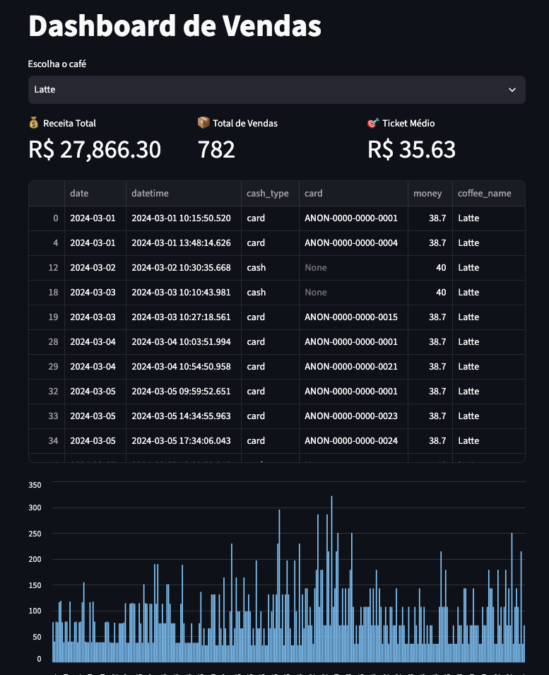

# 🖥️ Dashboard com Interface

````
Um painel interativo com dados

🛠️ Tecnologia:
    - Streamlit

🧩 Funcionalidades:

    - Mostrar gráficos
    - Filtros (data, produto etc.)
    - Interface simples

🧩 Passo a passo:
    1. Reaproveitar dados do projeto 2
    2. Criar app com Streamlit
    3. Adicionar filtros
    4. Rodar localmente

## 📸 Preview



🔗 [Ver dashboard ao vivo](https://coffeesales-fpcpepvej5bkbf4bhjdajj.streamlit.app/)
